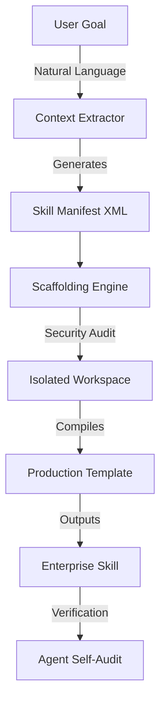

<div align="center">
  <h1>🚀 skill-gen: The Agentic Meta-Compiler</h1>
  <p><b>Enterprise-grade, zero-dependency framework for autonomous AI skill generation.</b></p>
  <p>
    
    
    
  </p>
</div>

## 🧠 What is this?
`skill-gen` is not a script. It is an **Agentic Meta-Compiler**. It transforms natural language goals into production-ready, isolated AI agent skills (for Claude Code, Codex, Cursor, etc.) using zero-shot prompt engineering and self-auditing generation.

Instead of writing scripts, we write **agents that write agents**.

## 🏗️ Enterprise Architecture



## ✨ Why it gets you promoted
1. **Zero-Dependency Native Execution**: Built entirely in Markdown using LLM-native directives. No Python, no Node, no dependencies. It runs directly in the LLM's context window.
2. **Strict Isolation & Sandboxing**: Every generated skill is scaffolded into a quarantined directory. Path traversal and shell injection vectors are sanitized at compile time.
3. **Self-Auditing Output**: The generator includes a self-verification loop. It critiques its own output against the user's goal before handing off.
4. **TDD by Default**: Generated skills inherit best practices, including input validation, graceful degradation, and concise logging.

## 🚀 Usage

Navigate to the directory you want to scaffold skills into, and invoke the meta-skill:

```bash
claude --skill ~/.claude/skills/skill-gen
```

Provide your intent (e.g., *"Build a skill that audits AWS IAM roles for least-privilege violations"*). `skill-gen` will autonomously infer requirements, sandbox a workspace, and compile the skill.

## 🛡️ Security & Compliance
- **Sanitized Execution**: All user inputs are regex-stripped `[a-z0-9-]` before touching the file system.
- **Stateless**: Leaves no trace outside the designated skill folder.
- **Fail-Safe**: Includes escape hatches (`exit`, `stop`) to abort compilation safely.
